:toc:

= ソフトウェア工学概論での Github Classroom の使い方と練習

ソフトウェア工学概論で Github Classroom に課題を提出する方法です。

* ❗ *`前準備` 、`1` から `4` は、初回だけ* 必要です。❗ 
* *その後（第2回以降）は、課題の都度、 `5. 提出物の更新（毎回）` の内容を行えばOK* です。
* Git/GitHub の使い方は、第1回目の課題にしてあるので、わからない部分はそちらを参照してください。
* *この授業の課題達成は classroom の方で確認していきます* ( 個人のgithubのリポジトリは採点対象にしません）ので、*今後の課題の内容は必ず classroom のリポジトリに push* してください。

== 前準備

*⚠ IntelliJ IDEA を起動している場合は、一度プロジェクトを close してください。*

課題のプロジェクトを開いた状態で手順を進めると、プロジェクトが壊れることがあります。

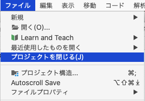 

'''

== 1. Classroom（課題提出場所）の準備

授業の課題ページで *Classroom のURL を指定しておくので、ブラウザでアクセス* してから、以下の操作をしてください。

=== 1-1.ログインが必要な場合

ログイン画面が表示されるので、あなたのGitHubアカウントでログインしてください。

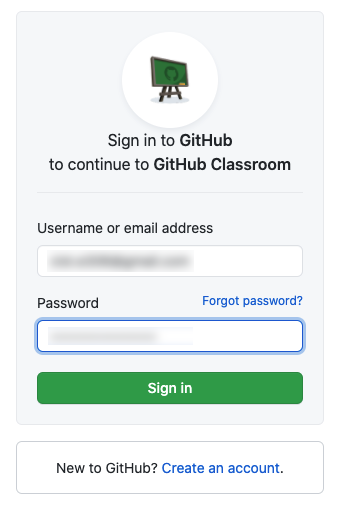

=== 1-2.学籍番号の選択

授業の課題名と、学籍番号の一覧が表示されます。この中から、 *自分の学籍番号を探して、間違いやとり違えのないように選択* してください。（一度、確認が出ます） 

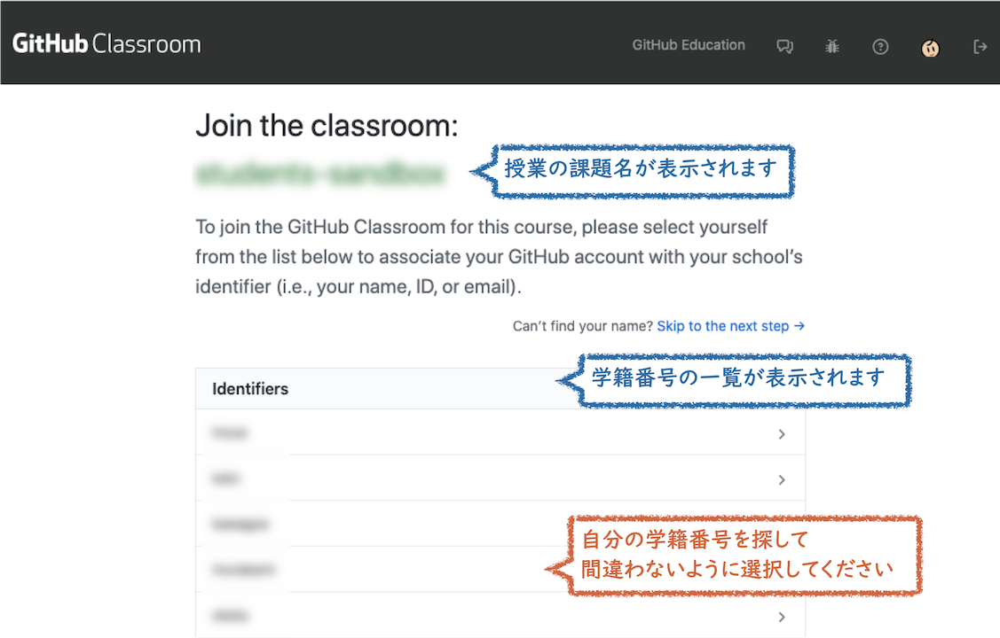

=== 1-3.課題開始の確認

*`Accept this assignment` をクリック* します。

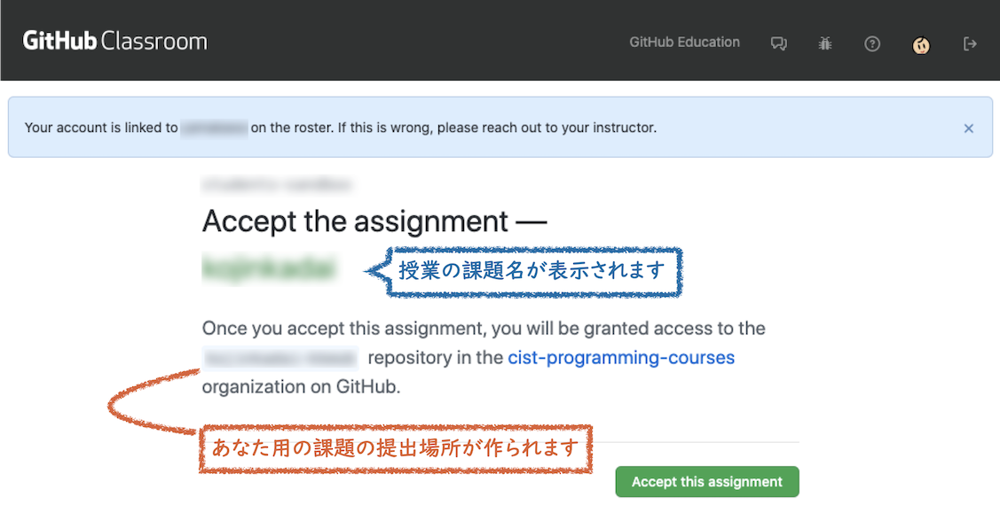

=== 1-4.課題の提出場所の作成

2, 3分程度待ってから、ブラウザの更新ボタンを押します。

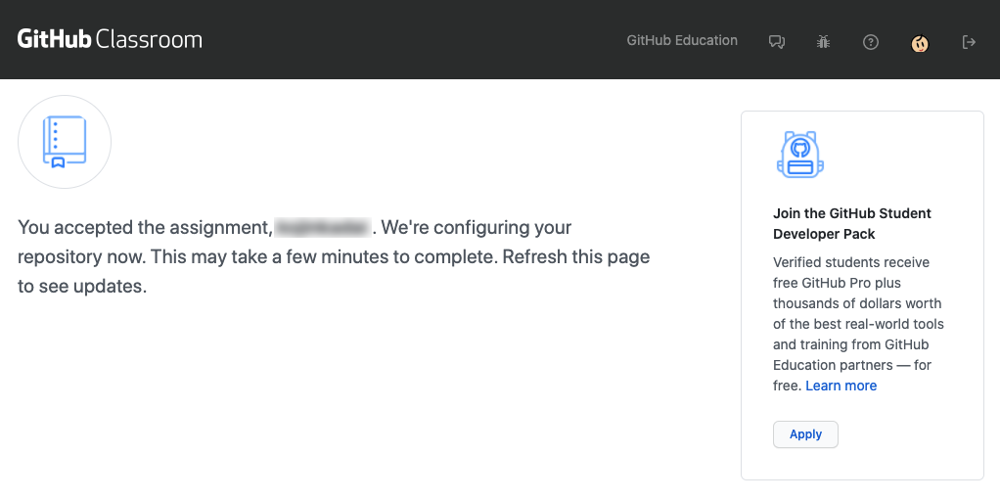

=== 1-5.課題の提出場所の作成（完了）

*Classroomに、あなたの 課題提出場所（リポジトリ）のURLが生成されるので、コピー* します。

`https://github.com/cist-ictdev-2022/se22-xxxxxx` （xxxxxxの部分は各自異なる） のようなURLになります。

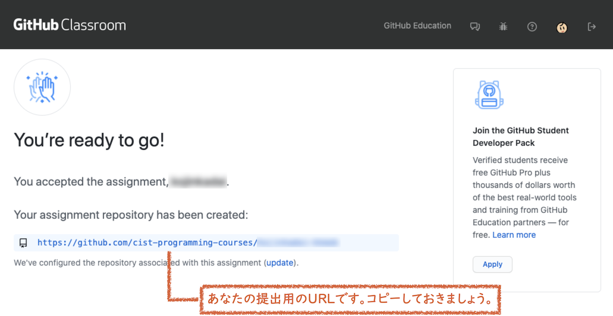

'''

== 2. 課題提出場所（リポジトリ）への課題提出（初回）

=== 2-1.ブラウザで開く

1-5 でコピーした、あなたの Classroomの課題提出場所（リポジトリ）のURL を、ブラウザで開きます。

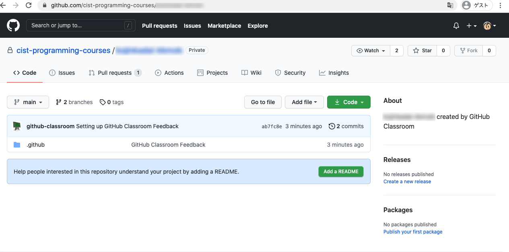

=== 2-2. git cloneの準備

`code` ボタンを押し、**clone用のURLをコピー** します。(URLの横のボタンを押すと簡単にコピーできます)

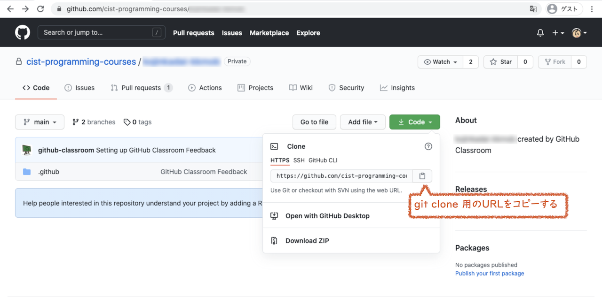

=== 2-3. git clone

あなたのPCの、課題を置いておきたいフォルダの中で、課題提出場所のリポジトリを `clone` します。 +
（Windows の場合：Git Bash, macOS の場合：ターミナル、Linux の場合：端末 でコマンドを実行）

[source, sh]
----
git clone https://github.com/cist-ictdev-2022/se22-xxxxxx.git    #<1>
----
<1> xxxxxx の部分はそれぞれ異なる。

cloneすると、 `se22-xxxxxx` （xxxxxxの部分は各自異なる）というフォルダができる予定です。


=== 2-4. 課題用のプロジェクトのダウンロードと展開

課題用のプロジェクトは、Githubの別の場所で公開をしています。

https://github.com/cist-ictdev-2022/linebot  にアクセスします。

`code` ボタンを押し、今度は、`Download ZIP` をクリックします。

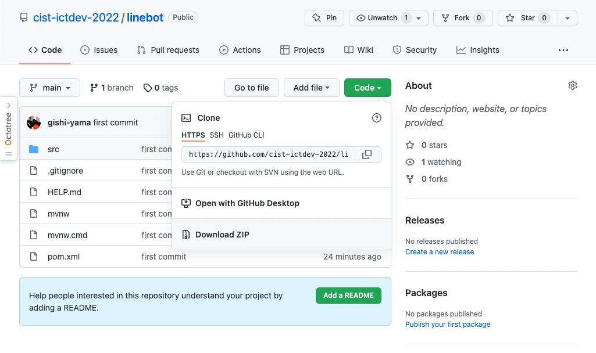

=== 2-5. 課題用のプロジェクトの移動

2-4 でダウンロードした linebot-main.zip をダブルクリックします。

**中身の linebot-main フォルダを、2-3 で作成された `se22-xxxxxx` フォルダの中に移動（追加）** してください。

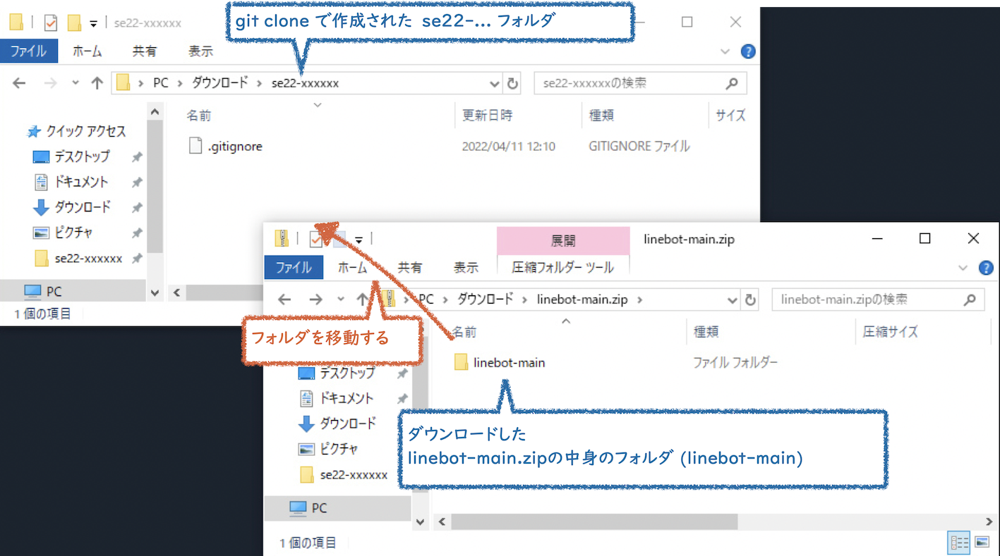

==== ❗ 注意事項❗

やり方によっては、フォルダの階層が `se22-xxxxxx` > `linebot-main` > `linebot-main` > `src, その他ファイル...` のように、`linebot-main` フォルダが2階層に重複してしまうことがあります。

*このような、重複状態にならないように注意* してください。

`se22-xxxxxx` > `linebot-main` > `src, その他ファイル...` のように、 *`se22-xxxxxx` フォルダ の下には一階層だけ、 `linebot-main` フォルダがある* ようにしてください。

=== 2-6. 変更した se22-xxxxxx フォルダの提出

2-5 で、linebot-main を追加した `se22-xxxxxx` フォルダを、Classroom に提出します。

git clone したフォルダで、次のコマンドを実行してください。

[source, sh]
----
git add .
----

[source, sh]
----
git commit -m "プロジェクトの準備まで進めた"
----

[source, sh]
----
git push
----

=== 2-7. 提出されているかの確認

`2-1.ブラウザで開く` をもう一度行い、課題のフォルダが提出（push）されていることを確認する。

==== ポイント

あなたがpushしたClassroom上のリポジトリは、自動的に private 設定になるようにしてあります。

あなたの他は、教員/TAからのみ確認できる仕組みになっています。

'''


== 3. プロジェクトの初期化

今後の課題では、皆さんのプログラムの変更内容が Classroom の方に反映される様にしてもらいます。

*プログラムを変更するときは、 `se22-xxxxxx` フォルダの中の `linebot-main` フォルダを intelliJ IDEAで開いて* 、変更を行なってください。

また、プログラムを変更したら、 `3. 提出物の更新` の手順で、どんどん変更内容を Classroom に変更内容をPushしてください。

プログラムで質問がある場合も、教員やTAは Classroom からソースコードの状況が確認できますので、pushの上で質問をしてください。

実際に、課題の準備（プロジェクトの初期化）を兼ねた練習をしてみましょう。

=== 3-1. IntelliJ に読み込む

`se22-xxxxxx` フォルダの中の `linebot-main` フォルダを intelliJ IDEAで開いてください。  +（信頼して開きますか？というダイアログが出た場合は `プロジェクトを信頼` を選んでください）

右下の「linebotの依存関係を解決中」などのプログレスバーが全て完了するまで待ってください（少し時間がかかります）。

=== 3-2. プロジェクトの初期設定（Java 17 のインストール）

今回のプロジェクトは、 昨年11月にリリースされた Java 17 で動作するようになっています。

皆さんのIntelliJ IDEAにも、Java 17 をインストールする必要があります。（もし既にJava 17を利用している人は、プロジェクトのSDKを17にしてください）

=== 3-3. Java 17 をインストール

ファイルメニューから `ファイル` > `プロジェクト構造` を選択してください。

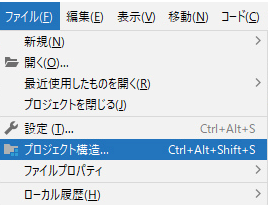

プロジェクト構造ダイアログの中で、`プラットフォーム設定` の `SDK` を選んでください。

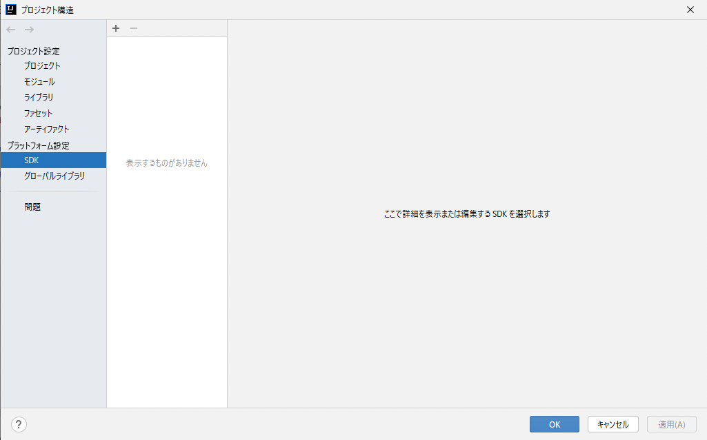

`+` ボタンを押して、`JDKのダウンロード` を押してください。

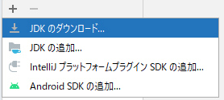

JDKのダウンロードダイアログの中で、`バージョン` を `17` に切り替え、`ダウンロード` を選んでください。

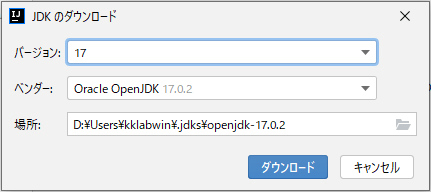

. ダウンロードが完了したら、名前欄に `openjdk-17` が表示されていることを確認し `適用` ボタンを押してください。

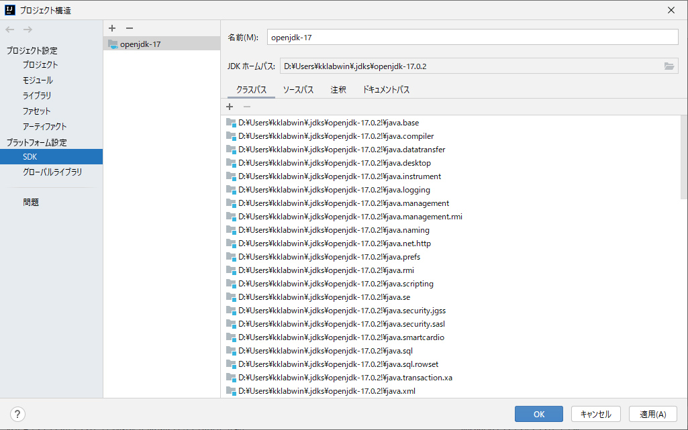

=== 3-4. Java 17 を利用するように設定

プロジェクト構造ダイアログの中で、`プロジェクト設定` の `プロジェクト` を選んでください。

`SDK` の欄を `openjdk-17` にして、 `適用` ボタンを押してください。

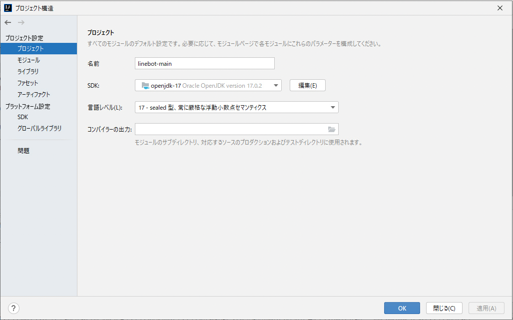

プロジェクト構造ダイアログの中で、`プロジェクト設定` の `モジュール` を選んでください。

`言語レベル` の欄を `17 - sealed型...` にして、 `適用` ボタンを押してください。

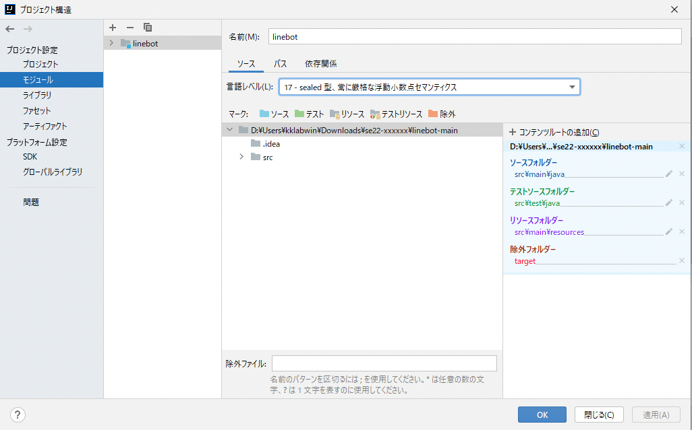

`OK`ボタンを押して閉じます。

== 4. 今後の課題の取り組み方の練習

=== 4-1. プログラムを作成し、動作するかを確認

ソース・パッケージ（src/main/java）のcom.example.linebotパッケージの中にPushクラスを作る。

[source, java]
----
package com.example.linebot;

import org.springframework.web.bind.annotation.GetMapping;
import org.springframework.web.bind.annotation.RestController;

import javax.servlet.http.HttpServletRequest;

@RestController
public class Push {

  // テスト
  @GetMapping("test")
  public String hello(HttpServletRequest request) {
    return "Get from " + request.getRequestURL();
  }

}
----

LinebotApplication を右クリックで起動する。

ブラウザから、link:http://localhost:8080/test[http://localhost:8080/test] にアクセスする。以下の様に表示されれば成功。

```
Get from http://localhost:8080/test
```

=== 4-2. プログラムの変更を commit / push する

git bash（Windows） や ターミナル（mac OS）を開き、動作確認ができる部分まで変更できたことを、Classroomにgitで記録・提出してください。


[source, sh]
----
git add .
----

[source, sh]
----
git commit -m "動作確認ができるところまで進めた"
----

[source, sh]
----
git push
----

=== 4-3. 提出されているかの確認

`2-1.ブラウザで開く` をもう一度行い、課題のフォルダの中に、追加された Push.java のプログラムがあることを確認する。

'''

== 5. 提出物の更新（今後の授業でも、毎回）

課題を修正した時や、2回目以降の課題の内容（linebotの中身の更新）を提出する場合は、提出物を更新してください。

[source, sh]
----
git add .
----

[source, sh]
----
git commit -m "XXXXXX"    #<1>
----
<1> "XXXXXX" の部分は更新内容を他者に伝える様に書く。

コミットログは、 提出する内容についての説明を書いてください。

[source, sh]
----
git push
----

`2-1.ブラウザで開く` と同じことを行い、提出したい内容が反映されていることを確認してください。